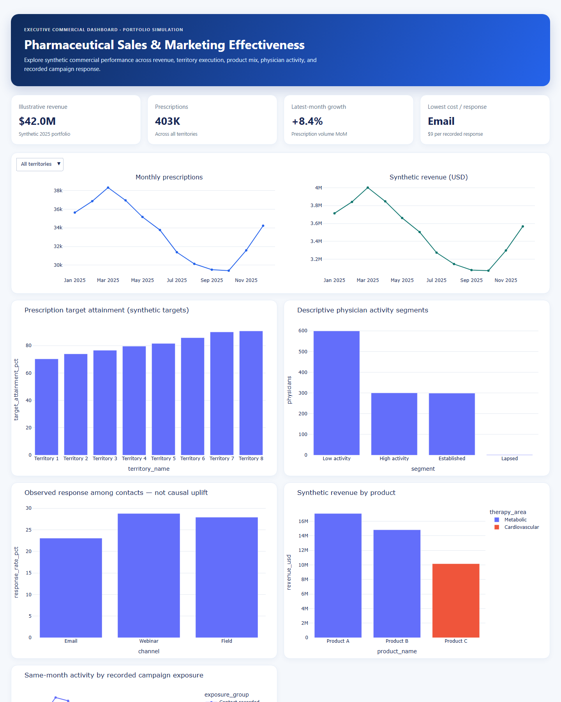

# Pharmaceutical Sales & Marketing Effectiveness Analytics

An end-to-end SQL and interactive-dashboard project for exploring synthetic pharmaceutical commercial performance across revenue, prescription activity, territory execution, product mix, physician segments, and campaign response.

> **Portfolio simulation:** every record, financial value, and finding is synthetic. Campaign views are descriptive and do not estimate causal uplift, incremental revenue, or ROI.

## Dashboard Preview



## Key Results

| KPI | Result |
| --- | ---: |
| Illustrative Revenue | $42.00M |
| Prescriptions | 402,975 |
| Physicians Analyzed | 1,200 |
| Highest Territory Target Attainment | 90.69% |
| Best Recorded Response Rate | 28.76% |
| Lowest Cost per Recorded Response | $8.68 |

## Business Questions

- How do prescription volume and illustrative revenue move over time?
- Which territories are above or below synthetic prescription targets?
- Which products and therapy areas contribute most to revenue?
- How are physicians distributed across retrospective activity segments?
- How do recorded campaign response rates and contact costs compare by channel?
- Does same-month activity differ when a campaign contact is recorded?

## What I Built

- A deterministic synthetic-data generator with seven commercial tables at defined grains.
- A SQLite reporting layer with reusable SQL views and independent pandas reconciliation.
- An executive HTML dashboard plus six interactive Plotly visualizations.
- MySQL 8 schema, loading, quality-audit, and analytics scripts for a local-server workflow.
- Validation checks for keys, grains, ranges, referential integrity, report denominators, and reproducibility.

## Technology Used

- Python: NumPy, pandas, Plotly
- SQL: SQLite and MySQL 8
- Analytics: KPI reporting, territory/product performance, activity segmentation, response and exposure analysis
- Quality: reconciliation tests and source-to-report validation
- Power BI: [local build guide](dashboard/powerbi_build_guide.md)

## Data Model

```text
territory (1) --< physician (1) --< prescription_month >-- (1) product
                                            |
                                          (1) calendar
physician (1) --< outreach >-- (1) campaign
```

`prescription_month` is at physician-product-month grain. `outreach` is at physician-month grain; campaign comparisons aggregate prescriptions to physician-month before joining. See the [data dictionary](docs/data_dictionary.md) and [KPI definitions](docs/kpi_definitions.md).

## Project Structure

```text
pharmaceutical-sales-marketing-analytics/
├── dashboard/       # Power BI build guide
├── docs/            # Data dictionary, KPIs, MySQL runbook
├── screenshots/     # README dashboard preview
├── sql/             # SQLite views and MySQL scripts
├── tests/           # Integrity and reconciliation tests
├── reconciliation.py
└── run.py            # Deterministic data-to-dashboard pipeline
```

## Run Locally

```powershell
cd pharmaceutical-sales-marketing-analytics
.\.venv-p1\Scripts\Activate.ps1
python -m pip install -r requirements.txt
python run.py
python -m pytest -q
```

Open `outputs/dashboard.html` after running. The workflow writes `outputs/validation.json` with `data_type: synthetic` and `sql_reconciliation: PASS`.

## Interpretation Limits

The generator sets product shares, prices, targets, contact selection, and response probabilities. Contacts are non-random and exposure comparisons have no time ordering; they cannot establish campaign effectiveness. Use this project as a reproducible analytics demonstration, not as real-world commercial evidence.
